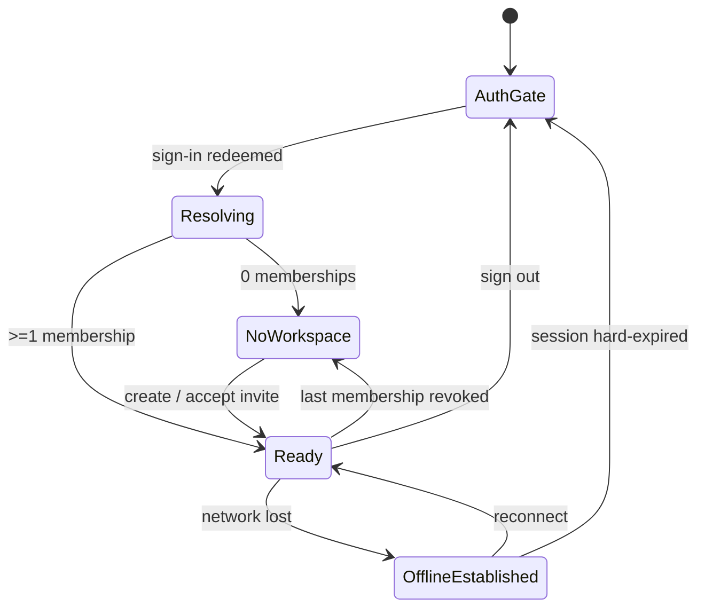

# ADR 0015 — The desktop app requires a cloud identity with workspace membership; workspaces & projects become a cloud-projected roster

**Date:** 2026-07-18 · **Status:** Proposed · **Deciders:** product + engineering

**Prompted by the decision:** *to make the desktop app seamless and truly useful, workspaces and projects should be synchronized from the cloud app — so only signed-in users who belong to at least one workspace should be able to use the desktop app.*

**Amends / extends:**

- **ADR 0003** (SQLite graph, no cloud) and **ADR 0010** (task-graph sync model): the desktop stays offline-first for an *established* session, but a **cold machine with no cached session can no longer reach the workspace** — this is a deliberate narrowing of "works with no network."
- **ADR 0010** §2: adds a **second sync direction and a second sync object** — a cloud→desktop projection of the *workspace/project roster*, distinct from the existing task-graph push.
- **ADR 0011** (cloud as product pillar; workspaces + membership + RLS, M2): promotes membership from a *sync-scoping* mechanism to the desktop's **entry gate**.
- **ADR 0014** (desktop signs in through the hosted web auth pages) + the 2026-07-18 refresh wiring: the login path is reused unchanged; this ADR only adds what happens *after* redeem.
- Architecture doc **§2.1 / §3.4** and the current desktop gate in `apps/desktop/src/App.tsx`.

---

## Context

### Where the desktop is today

The current app is **local-first with cloud strictly opt-in**:

- **Gate order** (`App.tsx`): engine health → **model onboarding** (`onboarding === "satisfied"`) → `Workspace`. There is **no auth gate and no membership gate**. A user can run the entire 3S flow having never signed in.
- **Projects are local-authoritative.** `listProjects()` reads the local engine (`/engine/projects`); each `Project` carries an optional `cloud_workspace_id` (`null` = "not in a workspace"). Projects are created locally and *optionally* linked to a workspace and pushed up.
- **Sign-in is optional** and lives in `TopBar`. When signed out, the bar shows "**Local workspace**" and a flat, unfiltered project list. `CloudConnect.tsx` states the posture plainly: *"most desktop users today are single-player."*
- **Sync is push-only and per-project opt-in** (link project → workspace → *Sync now*). Per the cloud README (M12), `apps/engine` gained its *first* pull-from-cloud capability only for discussions; requirements/specs/tasks/artifacts/agent-runs are still **push-only**, engine-as-source-of-truth.
- The cloud already has everything the roster needs: `GET /workspaces` (member-scoped), `GET /projects` (member-scoped), membership + invitations + RLS (M2, migrations 0003/0006–0008).

### What the decision changes

The decision makes cloud identity and workspace membership a **precondition for using the desktop app**, and makes the **cloud the authority for which workspaces and projects exist** for a user. That inverts two current defaults: the "single-player, no account" path, and "projects are born local, pushed up."

### The tension to resolve

ADR 0003/0010 promise the engine "works fully offline; a cloud outage never blocks local work." A naïve reading of the new rule — *always require a live, membership-verified session* — would break that promise on every flight and every Wi-Fi hiccup. The core design work of this ADR is drawing the line so the product gains the seamless, multi-device SaaS feel **without** turning a transient network loss into a locked-out app.

---

## Decision

### 1 — Access gating: identity + membership, verified at the edge, cached for offline

To reach the workspace surface, a user must have **(a)** a valid PromptConnext Cloud session and **(b)** membership in **≥1 workspace**. But "valid session" is satisfied by a **cached, not-yet-expired session**, not only a live network check. Concretely:

- **Cold start, never signed in, or signed out** → the **auth gate**: the "Sign in with browser" handoff (ADR 0014). Nothing else is reachable.
- **Signed in, zero workspaces** → the **no-workspace state** (see §4). The 3S surface stays blocked; the user creates or joins a workspace to proceed.
- **Signed in, ≥1 workspace** → the app opens on the cloud-projected roster.
- **Previously signed in, now offline** → the app opens against the **cached session + cached roster**. Local graph work continues. Only when the refresh token itself is invalid/expired *and* unrenewable does the session become "signed out" and drop to the auth gate.

**Gate ordering — auth/membership *before* model onboarding.** The existing model-onboarding gate (architecture §3.4, `ModelOnboardingState`) answers "can this user *do* 3S work"; the new gate answers "is this user *allowed in* and *whose* workspace." Identity is the outer gate:

```
engine health ──► auth (session?) ──► membership (≥1 workspace?) ──► model onboarding (satisfied?) ──► Workspace/3S
                     │  no                    │  none                        │  not satisfied
                     ▼                        ▼                              ▼
                sign-in handoff        no-workspace state              existing onboarding
```

This means `App.tsx` gains two gate checks ahead of its current `onboarding !== "satisfied"` branch.

### 2 — Cloud→desktop sync: a *roster* projection, separate from the *graph* sync

Two different things flow, and conflating them is the trap:

| Object | Direction | Authority | Mechanism |
|---|---|---|---|
| **Workspace/project roster** (which workspaces I'm in; which projects exist in them; names, ids, membership) | **cloud → desktop** (new) | **cloud-authoritative** | reuse existing `GET /workspaces` + `GET /projects`; mirror into a local roster cache |
| **Project task graph** (requirement→spec→task→artifact→agent-run) | desktop ⇄ cloud (existing) | **local-authoritative** for AI-native fields (ADR 0010 §2, per-field ownership unchanged) | existing `PUT/GET /sync/projects/{id}/graph` |

Key consequences of the split:

- **The roster is cloud-authoritative; the graph content is not.** Membership decides *what projects you can see*; the engine remains source of truth for *what's inside* a project. ADR 0010's conflict model is untouched.
- **Opening a cloud project you don't have locally requires a full graph bootstrap-pull.** The cloud already serves it (`GET /sync/projects/{id}/graph`, no `since` = bootstrap, tombstones hidden). This **extends the engine's pull capability** from M12's discussions-only to a full-graph hydrate — the single largest engine change this ADR implies.
- **v1 needs no new cloud endpoints.** The roster projection is built from endpoints that already exist and are already RLS-scoped. New work is concentrated in the **engine** (roster cache + graph hydrate) and the **desktop shell** (gates + roster-driven navigation).
- **Trigger** follows ADR 0010's manual-first spirit but auto-pulls the roster at the moments it must be fresh: on sign-in, on app focus, and on explicit refresh. Continuous/push-driven roster updates are deferred with the rest of auto-sync.

### 3 — Auth/session flow: build on ADR 0014, add a membership resolve

The login mechanism is unchanged (browser handoff, opaque one-time code, keychain storage, 401-triggered refresh). This ADR adds the **post-redeem resolve** and the **sign-out teardown**:

1. **After redeem** (`redeemBrowserLogin`), fetch the user's workspaces. `TopBar.resolveWorkspace()` already does most of this — it lists memberships, remembers the last active workspace, and auto-enters a single membership. The change is that its outcome now **drives a gate**, not just a label.
2. **Zero memberships** → resolve to the no-workspace state (§4), not to a silent "Local workspace" fallback.
3. **Offline at resolve time** → keep the last-known roster/active workspace (TopBar already distinguishes "cloud unreachable" from "no workspaces" — preserve and promote that distinction to the gate).
4. **Sign-out** clears the session **and the local roster cache** (workspace/project names must not leak to the next user of the machine). Local project *graphs* on disk are retained but unreachable until re-auth; a future "wipe on sign-out" option is out of scope here.
5. **Session refresh** (already wired) is what makes the offline grace window real: a ~1h access token is refreshed silently, so "cached session" means days, not an hour.

### 4 — Empty & edge states

| # | State | Trigger | Desktop behavior |
|---|---|---|---|
| 1 | **Auth gate** | cold / signed out / no cached session | "Sign in with browser" (ADR 0014); nothing else reachable |
| 2 | **No workspace** | signed in, 0 memberships | dedicated screen: *"You're not in a workspace yet"* → **create workspace** and/or **accept an invite**; 3S stays blocked |
| 3 | **Normal** | signed in, ≥1 workspace, online | roster pulled; workspace switcher + project tabs (today's `TopBar` layout) |
| 4 | **Offline, established** | was signed in, network lost | open on cached session + cached roster; local graph work continues; a "reconnect to sync" banner; roster edits disabled |
| 5 | **Session hard-expired offline** | refresh token invalid *and* no network | treat as signed out → state 1 (cannot verify identity at all) |
| 6 | **Membership revoked** | admin removes user (while offline or online) | next roster pull drops that workspace's projects; if 0 remain → state 2. RLS already blocks that project's graph sync server-side |
| 7 | **Last workspace lost mid-session** | user removed from / deletion of their only workspace | transition live to state 2 |
| 8 | **Invite accepted** | user accepts via web (`POST /invitations/{token}/accept`) | workspace appears on next roster pull; no desktop-native accept flow required for v1 |
| 9 | **New device** | signed-in user, empty local disk | roster pulls the full workspace/project list; opening a project triggers the graph bootstrap-pull (§2) |
| 10 | **Dev / stub mode** | `AUTH_MODE=stub` (`X-User-Id`) | gate relaxed exactly as auth is relaxed today, so local backend testing still works |



### 5 — Two supporting decisions

- **Auto-provision a personal workspace on first sign-in (recommended).** The zero-workspace dead-end (state 2) is the single biggest friction the new gate introduces — a brand-new user would sign in and immediately hit a wall. Minting a default **"{user}'s workspace"** on first sign-in (admin = the user) makes the common path *sign in → straight into a usable workspace*, which is exactly the "seamless" the decision asks for. Teams still create/join shared workspaces normally. *(This is a cloud-side change: create-on-first-login, idempotent.)*
- **Project creation stays workspace-scoped, engine-first.** A new project is still created against the local engine (offline-first for the *graph*), but it must be born into the **active workspace** (`workspace_id` required) rather than the current "unassigned then optionally link" path. It pushes to the cloud roster on the next sync; offline, it's pending-sync and flushes on reconnect. The cloud roster remains the authority for *visibility*; the engine remains the authority for *content*.

---

## Options considered (gating strength)

### A. Hard gate — require a live, membership-verified session on every launch
Simplest mental model, but **breaks ADR 0003/0010 offline-first** outright: no flights, no flaky Wi-Fi, a cloud blip locks the app. Rejected — it trades the product's differentiator (local, private, offline-capable) for a login screen.

### B. Cold-start gate + cached-session offline grace (**chosen**)
Identity is required to *ever* enter, but a verified session is **cached and refresh-extended**, so an established user keeps working offline. Meets the decision ("only signed-in members use the app") while preserving offline-first for the case that actually matters. Cost: a genuinely new machine with no network can't onboard — accepted, because it also has no projects and nothing to do.

### C. Soft nudge — encourage sign-in, don't enforce
Closest to today. **Does not satisfy the decision** ("only signed-in members should be able to use the desktop app"). Rejected.

---

## Consequences

**Easier / better**

- **Seamless multi-device.** Sign in on any machine and your workspaces + projects appear — the roster projection is the mechanism that delivers the decision's promise.
- **One consistent access model.** Membership already gates cloud reads via RLS; making it the desktop gate too removes the "local-only side door" and the two-worlds behavior in `TopBar` (grouped vs. flat).
- **Stakeholder/collaboration story lands.** Projects created by teammates become visible on the desktop without manual linking.

**Harder / costs**

- **Offline-first narrows for cold start.** ADR 0003's "works with no network" now holds only *after* a first successful sign-in on that machine. This must be stated in the architecture doc, not left implicit.
- **Solo/local-only users now need a cloud account.** A product that prided itself on local-first adds a hard cloud dependency to first use. The personal-workspace auto-provision (§5) is what keeps this from feeling like a tax.
- **Engine gains full graph pull.** Extending beyond M12's discussions-only pull is real work with real conflict-surface (though ADR 0010's per-field ownership already defines the merge).
- **Sign-out must scrub the roster cache** — a new privacy obligation on shared machines.

**Revisit when**

- Auto-sync (ADR 0010 decision 3/4) ships → roster updates can become push-driven instead of pull-on-focus.
- A team asks for a true **local-only / air-gapped** mode → reintroduce an explicit offline profile rather than weakening the gate for everyone.
- Desktop-native invite acceptance is demanded (v1 defers it to the web).

---

## What changes, concretely (non-binding implementation map)

- **`apps/desktop/src/App.tsx`** — add auth + membership gates ahead of the model-onboarding branch; render the auth gate and the no-workspace state.
- **`apps/desktop/src/components/TopBar.tsx`** — `resolveWorkspace()` outcome drives a gate, not just a label; drop the signed-out "Local workspace" flat view; keep the "cloud unreachable ≠ no workspaces" distinction (it becomes load-bearing for offline state 4).
- **`apps/desktop/src/components/Workspace.tsx`** — project list is roster-driven; new-project creation requires an active workspace.
- **`apps/engine`** — a local **roster cache** (workspaces + project metadata) that renders offline; **full-graph bootstrap-pull** on opening a cloud project not present locally; clear roster on logout.
- **`apps/cloud`** — (recommended) idempotent personal-workspace creation on first sign-in. No new roster endpoints needed for v1.
- **`apps/web`** — remains where invites are accepted (ADR 0011 read-first posture).

---

## Action items

1. [ ] Accept / revise this ADR (esp. §5 personal-workspace auto-provision and the engine-first project-creation call).
2. [ ] Confirm the offline grace policy: exact behavior when the refresh token expires with no network (state 5) — hard gate vs. read-only cached view.
3. [ ] Companion plan under `docs/plans/` — sequence the engine roster cache + graph hydrate, the desktop gates, and the cloud auto-provision behind a feature flag for staged rollout.
4. [ ] Update architecture doc §2.1/§3.4 wording once accepted ("offline-first *after first sign-in*"; two gates, identity outermost).
5. [ ] Decide whether existing local-only projects (today's `cloud_workspace_id = null`) are migrated into the user's personal workspace on first gated launch, or surfaced as an "import to a workspace" prompt.
