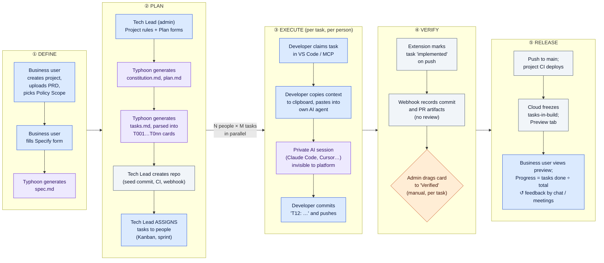
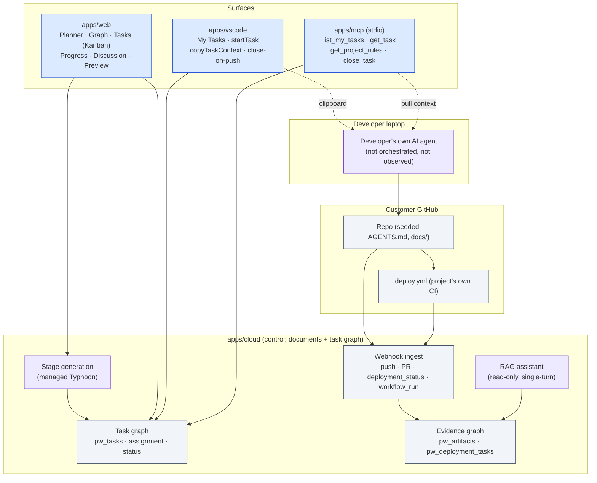
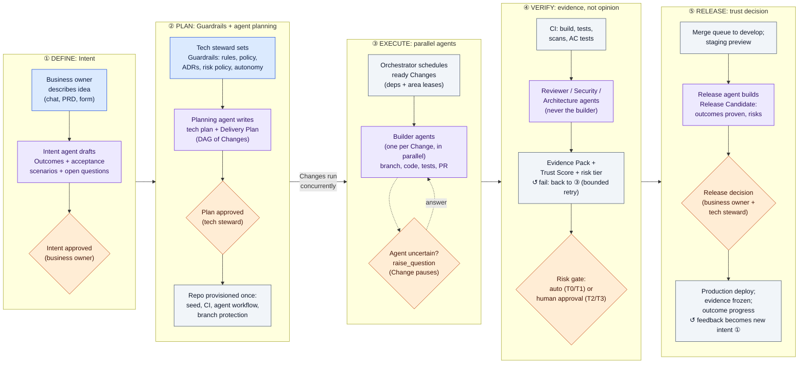
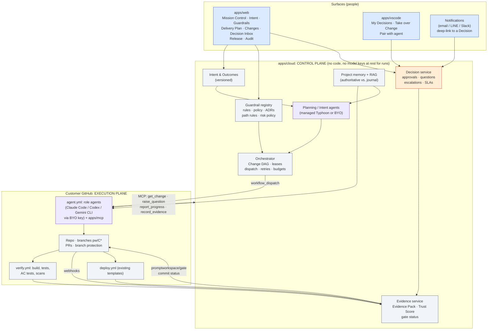
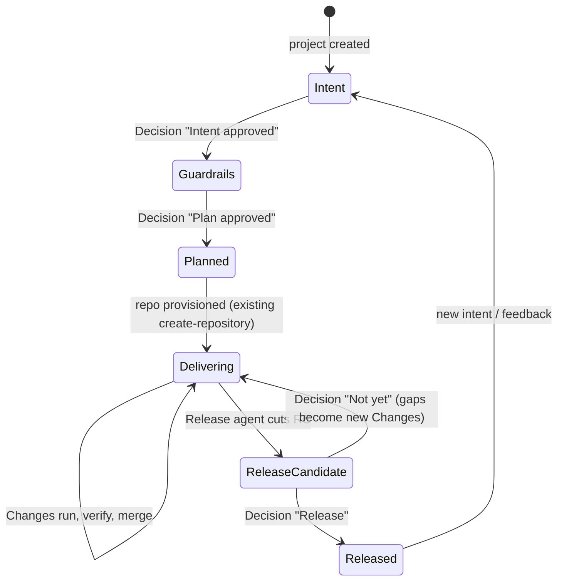
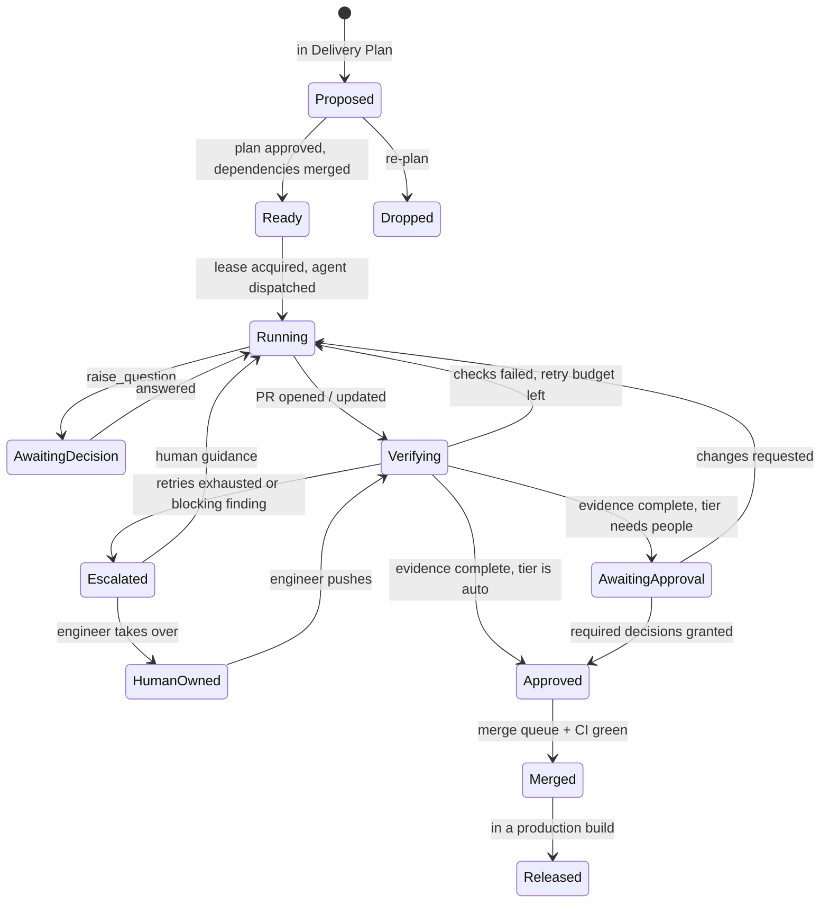

# Plan 0029: Agent-native delivery. Agents do the work, people govern the outcome

**Date:** 2026-10-04 · **Status:** Draft for review (product reframing; no code yet) · **Basis:** `develop` at `444540e`: source, migrations, ADRs 0001–0028, plans 0001–0028, and the [product vision of 2026-09-12](../product-vision-2026-09-12.md)

**Relationship to existing documents.** This builds on the product vision rather than replacing it. The vision said PromptWorkspace is "a governance and auditability product wearing a planning-tool interface" (§4). This plan takes that literally: the planning-tool interface (task board, assignment, manual `verified`) is the part designed for the old way of working. The governance core underneath (evidence graph, policy scope, seeded repo, CI-observed deploys) is what the agent era needs most. Four follow-up ADRs are proposed in §12. Until they are accepted, nothing here overrides an accepted ADR.

Where this document describes today's behaviour, it cites the code. Where it proposes, it says so.

---

## 0. The argument in one page

PromptWorkspace today is a good **traditional delivery tool with AI-generated documents**. A model writes the spec, plan and checklist. Then the product turns the checklist into `T001…T0nn` cards, a person assigns cards to people, each person carries a card to their editor, copies its context to the clipboard, pastes it into whatever AI agent they use, and commits `T12: …`. The platform watches the push, and an admin drags the card to **Verified** by hand.

AI helps at two points: writing the documents, and inside each developer's private editor session. Every step between those points is still built around people: assignment, claiming, status moves, context hand-off and verification. The workflow is the old one, made faster.

The agent era changes where the scarce resource is. Once implementation is cheap and parallel, the bottleneck moves to the things only people can supply:

1. **Intent.** What outcome do we want, and how will we know we got it?
2. **Guardrails.** What must never happen, what must always hold, and who decides exceptions?
3. **Decisions.** What do we do when the spec is ambiguous, two options are both reasonable, or the risk is real?
4. **Trust.** Is this change proven well enough to ship?

So the product should be organised around those four things, not around tasks. The proposed model:

```
Intent → Outcomes → Guardrails → Agent planning → Parallel agent execution
       → Automated verification → Risk-based human decisions → Release
```

Five changes carry the reframing:

| From (today) | To (proposed) |
|---|---|
| **Task** (`T012`, assigned to a person, moved by hand) is the unit of work | **Change** (`C3`, one branch and one PR, executed by agents) is the unit of delivery. Tasks survive as the steps inside a Change |
| **Assignment** to people | **Delegation** to agent roles. People are attached to *decisions*, not to work items |
| **Kanban board** as the main surface | **Mission Control** (outcomes, what agents are doing, what needs a human) and a **Decision Inbox** |
| **Manual `verified`** dragged by an admin | **Evidence Pack** per Change (tests, acceptance-criteria proof, scans, reviews) plus a **risk-tiered gate** enforced on the PR by a required status check |
| **Progress** = tasks done ÷ tasks total | **Outcome progress** = acceptance scenarios proven by passing evidence on a running build |

None of this needs a rewrite. The cloud already holds the plan, the rules and the evidence chain. The repo is already seeded with agent context (`AGENTS.md`). The webhooks already observe CI. Four deployment templates already run in the customer's own CI. What is missing is an execution plane for agents, a verification layer, and a decision layer. §9 scopes those as an MVP on the existing platform.

---

## 1. As-Is: how PromptWorkspace works today

### 1.1 Walkthrough

**Define.** A member creates a project in `NewProjectDialog.tsx`, either from scratch or by importing a GitHub repo (`POST /projects`, `apps/cloud/app/api/sync.py:122`). On the Planner's **Foundation** tab they upload a PRD (`api/documents.py:39`) and pick a Policy Scope: Thai PDPA, Thai Law, GDPR, ISO 27001, SOC 2, an internal policy, or custom text (`policies/registry.py:37`). For an imported repo, an admin generates a codebase baseline (`api/repo_analysis.py:131`).

**Specify.** Any member fills the Specify form (what, problem, who, user journeys, success, out of scope, constraints; `stage-forms.ts:103`). The cloud streams `spec.md` from the managed Typhoon model (`POST /projects/{id}/generate/specify`, `api/generation.py:93`). The result is projected into a `Requirement` row.

**Plan** (admin only, the "Tech Lead" step; `ADMIN_ONLY_STAGES`, `api/_guards.py:73`). The admin generates **Project rules** (the constitution) from a five-question form, then `plan.md` from a technical-context form. Opening this tab fires `submit-for-review` and `start-tech-review` automatically (`Planner.tsx:691`). There is no explicit approval: `Requirement.status = approved` and `SpecDocument.approved_by` exist in the schema, but no code ever sets them.

**Tasks.** Any member generates `tasks.md`. `parse_task_lines` turns each `- [ ] T001 [P] …` line, with its `AC:` sub-bullets, into a `pw_tasks` row. Regeneration reconciles rows by reference (`stage_apply.py:303`).

**Provision.** The admin picks a deployment template and clicks **Create repository** (`sync.py:303`). The cloud creates the GitHub repo, writes Actions secrets, registers a per-repo webhook and makes one seed commit. That commit contains `AGENTS.md`, `README.md`, `docs/{scope,architecture,tasks,conventions,policy-scope}.md`, `.specify/memory/constitution.md`, the deploy scaffold and `.github/workflows/deploy.yml` (`integrations/repo_seed.py:98`). The lifecycle ends at `repo_created`.

**Assign.** On the **Tasks** tab, a Kanban board with To Do / In Progress / Implemented / Verified columns (`taskBoardA11y.ts:21`), an admin assigns tasks to members. A member can only assign themselves (`PATCH …/assignment`, `sync.py:1085`). Jira and ClickUp mirror `assignee` and `sprint`.

**Implement.** A developer opens **My Tasks** in the VS Code extension and runs `startTask`. That claims the task, moves it to `in_progress` and suggests a branch or a `T12: <title>` commit message (`apps/vscode/src/tasks/startTask.ts`). `copyTaskContext` puts the title, acceptance criteria, a spec excerpt and the coding rules **on the clipboard** (`copyContext.ts`). That clipboard copy is the only hand-off to an AI agent the product makes. Developers outside VS Code can pull the same context through the MCP server (`list_my_tasks`, `get_task`, `get_project_rules`, `close_task`). Either way, the developer drives their own agent, by hand, one task at a time.

**Close.** The extension watches git. When a commit naming `T12` has been pushed, it writes `status: implemented` plus a commit artifact (ADR 0022, `gitWatcher.ts`, `publication.ts`). On the server side, the push webhook records `Artifact(kind=code)` for referenced commits, and `pull_request` events link PRs to tasks (`api/github.py:211`). Neither changes status. Nobody reviews the PR inside the product.

**Verify.** An admin drags the card to **Verified**. Only admins may (`verified_requires_admin`, `sync.py:1118`). No automated check of the acceptance criteria exists.

**Release.** A push to `main` runs the project's own `deploy.yml`. The cloud observes `deployment_status` and `workflow_run`, upserts the `Deployment`, freezes the set of tasks in that build into `pw_deployment_tasks` (`deployments/attribution.py`), and shows the live app on the **Preview** tab with "What's in this build" (`PreviewPanel.tsx`, `BuildTasks.tsx`). **Progress** shows done ÷ total per requirement (`ProgressRollup.tsx`).

**Ask.** Anyone can ask the read-only, single-turn RAG assistant about the project (`api/assistant.py`). It cites its sources and cannot change anything.

### 1.2 As-Is diagram

Both diagrams use the same five columns (Define, Plan, Execute, Verify, Release) and the same colour key, so they can be compared column by column.



**Colour key:** blue = a person does it · purple = AI does it · grey = the platform or CI does it automatically · orange diamond = human gate. Both diagrams loop from ⑤ back to ①. Today the loop is informal (chat, meetings). In the To-Be model, preview feedback is captured as new intent.

The same flow as a swimlane grid, for readers without a Mermaid renderer:

| Lane \ Phase | ① Define | ② Plan | ③ Execute | ④ Verify | ⑤ Release |
|---|---|---|---|---|---|
| **Business user** | PRD, policy scope, Specify form | (none) | (none) | (none) | Looks at preview and % tasks done |
| **Tech Lead (admin)** | (none) | Rules and plan forms, creates repo, **assigns tasks** | (none) | **Drags every card to Verified** | Merges to `main` |
| **Developer** | (none) | (none) | **Claims task, copies context, drives own AI, commits, pushes** | Opens PR (optional) | (none) |
| **AI** | Writes `spec.md` | Writes constitution, plan, tasks | Private, untracked session per developer | (none) | (none) |
| **Platform / CI** | Stores documents | Parses tasks, seeds repo | (none) | Marks `implemented` on push, records artifacts | Deploys, freezes build tasks, preview |

### 1.3 As-Is architecture



### 1.4 Which assumptions here belong to the traditional model

| Assumption built into today's product | Where it lives | Why it does not hold for agent-native delivery |
|---|---|---|
| A person executes each unit of work | `assigned_user_id`, `startTask` claim, "My Tasks" | Agents execute, so a person on every task makes humans the bottleneck |
| Work is cut so one person can hold it (`T001` granularity) | `tasks.md` checklist parsed one line per row | Agents work best on coherent slices (a user story) that end in one reviewable PR, not on 40 single-line tickets |
| A status changes when a person says so | Drag-and-drop board, `setTaskStatus` | Status should come from what happened (agent run, CI, evidence), not from a click |
| Verification is a person looking | Admin-only `verified` | Volume of agent output makes per-task human inspection impossible. Proof has to be automated, and people review the *proof* and the *risk* |
| Context travels by copy-paste | `copyTaskContext` to clipboard | Agents should pull a complete, versioned brief and push structured results back |
| The AI session is private | No agent observability anywhere in cloud, extension or MCP | Without run traces, there is no evidence, no cost control and no audit trail for regulated buyers |
| Planning ends when tasks exist | Lifecycle stops at `repo_created` | Agent delivery needs a live plan: re-plan on failure, on new information and on feedback |
| Sprints and assignees are planning tools | `sprint`/`assignee` mirrored from Jira/ClickUp | Sprints pace human capacity. Agent capacity is elastic. The constraint becomes decision latency and risk |
| Progress is counting finished tasks | `ProgressRollup.tsx` | 100 % of tasks "implemented" says nothing about whether the outcome works |
| Rules are documents for people to read | Constitution, `docs/conventions.md` | Rules must be enforceable: some as prompts, some as CI checks, some as hard gates |

### 1.5 Gaps found while documenting today's flow

These matter for the migration because the new model depends on them:

- **Approval fields are never written.** `Requirement.status=approved` and `SpecDocument.approved_by` exist but nothing sets them. The To-Be model makes "intent approved" and "plan approved" real decisions.
- **Repo creation does not check its preconditions on the server.** The web disables **Create repository** unless the constitution and tasks exist (`CreateRepositoryPanel.tsx:286`), but `sync.py:303` does not check. A gate that lives only in the client is not a gate.
- **The 3S `stage_state` column is dead.** It is still in `pw_projects` but nothing reads or writes it. Remove it in the migration (§10, Phase 0).
- **No PR review, CI-result ingestion or acceptance-criteria check exists anywhere.** `workflow_run` is processed only for `deploy.yml` failures.
- **The legacy engine already contains agent adapters** (`apps/engine/src/agent/adapters/`: claude-code, gemini, codex, custom). ADR 0019 schedules them for deletion. The To-Be runner reuses this knowledge instead of losing it (§9).

---

## 2. To-Be: the agent-native workflow

### 2.1 Walkthrough

**① Define (people state intent).** A business owner describes the idea in plain language: talk to the assistant, upload a PRD, or fill the existing Specify form. The **Intent agent** drafts **Outcomes**: one per user journey, each with acceptance scenarios a non-engineer can read ("Given a patient with no account, when they book a slot, then they get an SMS within 1 minute"). It also lists open questions. The business owner edits, answers the questions, and **approves the intent** (Decision: *Intent approved*). This is the first point where a person is required.

**② Plan (people set guardrails, agents plan).** The tech steward sets **Guardrails**: the constitution, the policy scope, architecture decisions, path rules (what agents may touch), the risk policy (which changes need which approvals), budgets and the autonomy level. The **Planning agent** produces the technical plan and a **Delivery Plan**: a dependency graph of **Changes**, each covering one outcome slice and each planned to end in one PR. Every Change carries its steps (today's `T` tasks), predicted touched areas, a predicted risk tier and the acceptance scenarios it must prove. The steward **approves the plan** (Decision: *Plan approved*). That is the second required human point, and the last one before code exists.

**③ Execute (agents, in parallel).** The **Orchestrator** in the cloud schedules ready Changes, respecting dependencies and **area leases** (two Changes that touch the same module do not run at the same time). For each Change it dispatches the **agent workflow** in the customer's own GitHub Actions. The **Builder agent** works on branch `pw/C3-<slug>`. It pulls its brief through MCP, writes code and tests, commits `T012: …` per step, and opens a PR. When it hits ambiguity it does not guess. It calls `raise_question`, the Change pauses in **Awaiting decision**, and other Changes keep running.

**④ Verify (machines first, then agents, then people only where risk requires).** On every PR push:
1. **Deterministic checks** run in the project's CI: build, typecheck, lint, tests, secret scan, dependency audit, SAST.
2. **Acceptance proof:** each acceptance scenario must map to at least one passing test tagged with its ID, or to a passing scripted check against the PR preview.
3. **Independent agent reviews:** a Reviewer agent (correctness, maintainability), a Security agent (when the risk policy or policy scope triggers it) and an Architecture agent (against the constitution and ADRs). None of them is the agent that wrote the code.
4. **Evidence Pack and Trust Score:** the cloud assembles the results and computes a score from evidence. The agent's opinion of its own work is not an input.
5. **Gate:** the cloud posts a required `promptworkspace/gate` status on the PR. It goes green automatically for low-risk Changes with strong evidence. Otherwise it waits on the human decisions the risk tier demands.

Failed checks loop back to the Builder (bounded retries). If retries run out, the Change becomes an **Escalation** in the Decision Inbox.

**⑤ Release (people decide what ships).** Approved Changes merge to `develop` through a merge queue, and the staging preview updates. (This is the target shape. The MVP runs on today's single-environment templates; see §4.3 *Git* and §9.4.) The **Release agent** assembles a **Release Candidate**: outcomes covered, scenarios proven, evidence summary, known risks and a changelog in business language. The business owner checks the preview against their outcomes. Their feedback becomes new intent, not a ticket. The business owner and the steward make the **release decision**. Production deploys through the existing templates, and the evidence graph freezes what shipped.

### 2.2 To-Be diagram

Same five columns and colour key as §1.2.



| Lane \ Phase | ① Define | ② Plan | ③ Execute | ④ Verify | ⑤ Release |
|---|---|---|---|---|---|
| **Business owner** | **Describes intent, answers questions, approves intent** | (none) | Answers business questions agents raise | Approves Changes that touch business-critical rules (T3, if named) | **Checks preview against outcomes, gives feedback, decides release** |
| **Tech steward** | (none) | **Sets guardrails, approves plan** | Answers technical questions, resolves conflicts | **Approves T2/T3 Changes by reviewing evidence; spot-checks T1** | **Co-signs release** |
| **Engineer** | (none) | Reviews plan (optional) | **Takes over stuck Changes; pairs with agents on hard ones** | Does the human code review that T3 requires | (none) |
| **Agents** | Draft outcomes and questions | Draft tech plan and Delivery Plan | **Build, test, commit, open PRs, ask when unsure** | **Review, scan, prove acceptance criteria, fix findings** | Assemble Release Candidate and changelog |
| **Platform / CI** | Stores intent and versions | Provisions repo and branch protection | Schedules, leases, dispatches, observes | Runs CI, computes evidence and trust, posts gate status | Merge queue, deploy, freeze evidence |

Notice what is gone from the people lanes: assigning, claiming, copying context, dragging cards, and verifying task by task. Notice what is new: approving intent and plans, answering questions, judging evidence and risk, and deciding release.

### 2.3 To-Be architecture



Three architectural commitments keep this consistent with decisions already made:

1. **Agents run in the customer's own CI, not in our cloud.** This extends ADR 0021 ("the project's own CI deploys; the cloud observes") from deployment to implementation. Code never leaves the customer's Git host, the model key is the customer's (an Actions secret, BYO per ADR 0009), and the cloud remains a control plane that never builds, hosts or proxies. For the regulated Thai and Southeast Asian buyer the vision targets, this is the strongest version of the compliance story.
2. **No model writes the pipeline.** ADR 0024 becomes a hard guardrail: agent workflows are hand-written templates seeded by the cloud, and any agent diff touching `.github/workflows/**` or deployment scaffolds fails the gate.
3. **The gate lives in GitHub, not in our UI.** A required `promptworkspace/gate` status check plus branch protection means a Change cannot merge without its decisions, even if someone bypasses PromptWorkspace. A client-only gate (§1.5) is not a gate.

---

## 3. As-Is vs. To-Be

### 3.1 What changes

| Dimension | As-Is | To-Be |
|---|---|---|
| Unit of value | Requirement (rarely looked at after spec) | **Outcome** with acceptance scenarios, tracked to release |
| Unit of work | Task (`T012`), one person | **Change** (`C3`), one PR, agent-executed. Tasks become its steps |
| Who executes | Developers, each with a private AI | Role agents in CI. Engineers handle exceptions |
| How work starts | Admin assigns, developer claims | Orchestrator dispatches when dependencies, leases and budget allow |
| Context hand-off | Clipboard | Versioned **Change brief** over MCP, plus seeded repo memory |
| Uncertainty | Developer asks on chat, or guesses | `raise_question` becomes a typed Decision. The Change pauses, others continue |
| Conflicts | Developers discover them at merge | Prevented by area leases, caught by merge queue plus full CI, resolved by rebase agent or escalated |
| Verification | Admin drags to Verified | Evidence Pack: CI + acceptance proof + independent agent reviews + Trust Score |
| Human approval | Implicit and per task | **Risk-tiered**: none for T0, batched for T1, per Change for T2, two people plus code review for T3 |
| Status source | Clicks and push detection | Events: agent run, CI, gate, merge, deploy |
| Progress | Tasks done ÷ total | Scenarios proven on a running build ÷ scenarios in scope |
| Business user role | Writes PRD, watches | Owns intent, answers business questions, accepts outcomes, decides release |
| Developer role | Implements tasks | Engineer: writes guardrails, approves risky Changes, takes over stuck ones, improves the agent setup |
| Audit trail | Requirement → task → commit → build | Intent → outcome → Change → agent run → evidence → **decision (who, why)** → build |

### 3.2 Concept inventory: what stays, what evolves, what goes

| Concept | Verdict | Becomes |
|---|---|---|
| Planner stages (Foundation, Specify, Plan, Tasks) | **Evolves** | Foundation and Specify become **Intent**. Project rules become part of **Guardrails**. Plan and Tasks become **Delivery Plan** (agent-drafted, human-approved) |
| Constitution / Project rules | **Stays, gets teeth** | Guardrails, each tagged *prompt*, *check* or *gate* (§5.4) |
| Policy Scope | **Stays, gets teeth** | Drives risk tiers and required reviewers, not only prompt text |
| `tasks.md` and `T` refs | **Stays** | Steps inside a Change. The task-ref grammar is unchanged, so commits still say `T012: …` |
| Task assignment (`assigned_user_id`) | **Demoted** | Kept for human-executed Changes and for tracker sync. Not on the main path |
| Kanban board | **Demoted** | A "Steps" view inside a Change, and an optional board for human-executed work |
| Sprints (`sprint` field) | **Removed from the core** | Kept only as a Jira/ClickUp mirror field. Pacing comes from budgets, decision capacity and releases |
| Manual `verified` | **Replaced** | Evidence plus gate. `verified` is set by the gate, and an admin override is logged as a Decision |
| `implemented` on push (ADR 0022) | **Evolves** | A step is `implemented` when its commit is pushed. A Change is `merged` when its PR merges |
| Repo provisioning at `repo_created` | **Stays, extended** | Also seeds `agent.yml`, `verify.yml`, branch protection and the runner token |
| Webhook evidence chain | **Stays, extended** | Adds `workflow_run` for `verify.yml`, PR reviews and check results |
| Deployment templates and Preview | **Stays** | Preview becomes the place where people check outcomes. PR previews are added later |
| Discussion tab | **Merges** | Into Decision threads and comments on any node |
| RAG assistant | **Evolves** | **Project concierge**: multi-turn, drafts intent, explains evidence, files questions. Writes only through Decisions |
| VS Code extension | **Evolves** | From "my tasks" to "my decisions" and "take over / pair on a Change" |
| MCP server | **Grows** | The agents' contract with the cloud (`get_change`, `raise_question`, `report_progress`, `record_evidence`) |
| Legacy engine agent adapters | **Salvaged** | Ported into the runner action. The rest of the engine retires per ADR 0019 |
| `stage_state` (3S) column | **Removed** | (dead today) |
| Jira / ClickUp | **Demoted** | Outbound mirror of Changes and outcomes for organisations that still report there |

### 3.3 Where human responsibility shifts

```
            AS-IS: people spend their time here         TO-BE: people spend their time here
            ────────────────────────────────────        ─────────────────────────────────────
Define      ██░░░░  write PRD                           ████░░  state intent, approve outcomes
Plan        ███░░░  write rules, assign tasks           ████░░  set guardrails, approve plan
Execute     ██████  implement every task                █░░░░░  answer questions, take over exceptions
Verify      ███░░░  eyeball and drag cards              ███░░░  judge evidence on risky Changes
Release     █░░░░░  merge and hope                      ███░░░  accept outcomes, decide release
```

The total effort moves from **execution** (the middle) to **both ends**: what we want and whether we trust what we got. The middle does not drop to zero. It turns into exception handling, which is where senior engineering judgement is worth the most.

---

## 4. The proposed end-to-end workflow

### 4.1 Project lifecycle (replaces `planning → … → repo_created`)



The old states map onto the new ones: `planning` covers Intent and Guardrails, `pending_tech_review` and `tech_review` become the *Plan approved* decision, and `repo_created` becomes Planned → Delivering. Today's server routes stay as the transitions. They gain the precondition checks that are currently client-only.

### 4.2 Change lifecycle (new; replaces the task status column as the primary state)



Task (step) statuses keep today's vocabulary (`todo | in_progress | implemented | verified`), so the extension, MCP, the task-ref grammar and the evidence graph keep working. A step is `verified` when its Change reaches *Approved*.

### 4.3 How the platform handles the hard parts

**Agent coordination and delegation.** The cloud Orchestrator is the only scheduler. Agents never assign work to each other. A Builder may *propose* a sub-Change (`propose_change`), and the proposal enters the plan as *Proposed*. It becomes *Ready* automatically if it stays inside the approved Outcome and risk tier, and it needs the steward otherwise. Each role is a **role profile**: instructions, allowed MCP tools, allowed paths, model/runtime, and token and time budget. Profiles are seeded into `.promptworkspace/agents/` so they are versioned with the code and reviewable like code.

**Shared context and memory.** Memory has two layers with different rules:

| Layer | Content | Who writes | Where |
|---|---|---|---|
| **Authoritative** | Outcomes, constitution, guardrails, ADRs, decisions log, codebase baseline | People, through Decisions. Agents may draft | Cloud (versioned) and mirrored into the repo (`AGENTS.md`, `docs/decisions/`, `docs/outcomes/`) |
| **Journal** | Per-run notes, "what I tried", discovered conventions | Agents | Cloud, attached to the Change, searchable by RAG, never injected as rules |

An agent can turn a journal entry into authoritative memory only by filing an **ADR proposal** decision ("We keep hitting X; propose rule Y"). This stops agents from writing their own rules, which is the main way agent memory goes wrong.

**Rules, constitution, ADRs and architectural constraints.** Every guardrail is enforced at one of three levels, and the Guardrails screen shows which:

| Level | Mechanism | Example |
|---|---|---|
| **Prompt** | Injected into every relevant agent brief | "Prefer server components; keep business logic in `lib/`" |
| **Check** | A deterministic test, lint rule or scanner in `verify.yml` | "No `console.log` of request bodies" (semgrep); dependency licence allow-list |
| **Gate** | Raises the risk tier or blocks the merge | "Touching `auth/**` is T3"; "Agents may not edit `.github/workflows/**`" (ADR 0024) |

The Architecture agent reviews each PR against the ADRs and reports violations as findings with file and line. An accepted violation needs a Decision that records the exception.

**Conflicting changes by multiple agents.** There are four layers, cheapest first:
1. **Avoid.** The Delivery Plan predicts touched areas. The Orchestrator gives each running Change a lease on its areas, and overlapping Changes queue. The tasks template already separates parallel user-story phases from sequential foundational ones, so most plans parallelise cleanly.
2. **Detect early.** Builders rebase on `develop` before opening and before each retry. Textual conflicts are fixed by the Builder inside its own lease.
3. **Catch semantic conflicts.** A merge queue runs the full `verify.yml` on the combined result before anything lands on `develop`.
4. **Escalate.** If two Changes cannot both hold (for example, they disagree on a data model), the result is a Decision of type *Conflict* for the steward, with both diffs and the agents' explanations.

**Git branches, commits, PRs and CI/CD.**

| Item | Convention |
|---|---|
| Branch | `pw/C3-booking-sms`, one per Change (the extension's branch-per-task suggestion becomes branch-per-Change) |
| Commit | `T012: send booking SMS`. The task-ref grammar and attribution are unchanged |
| PR | One per Change. Title `C3: <outcome slice>`. Body carries the brief link, the evidence summary and a `PromptWorkspace-Change: C3` trailer |
| Target | Today's templates deploy one `preview` environment from a push to `main` (`deploy.yml.tmpl`, `branches: [main]`; `_handle_deployment_status` keeps only `preview`). So in the MVP, Changes target `main`, the preview is the staging build, and the release decision promotes a reviewed preview build. From Phase 4, templates gain a second environment: Changes target `develop` (staging) and release is a `develop → main` PR, the same shape the PromptConnext product repos already use |
| Protection | Seeded at provisioning: PR required, `verify` + `promptworkspace/gate` required, agents' token cannot bypass |
| CI | `verify.yml` (new, hand-written template per stack) on PR. `deploy.yml` (existing) on `develop`/`main` |
| Merge | Merge queue (GitHub native) once the gate is green |

**Automated testing and verification.** The core rule is that **every acceptance scenario has an ID and needs proof**. Scenario `O2.S3` must be covered by a test whose name or tag carries `O2.S3`, or by a scripted check against the preview. `verify.yml` emits JUnit plus a small `evidence.json` that maps scenario IDs to results. The Test role writes tests from scenarios *before* the Builder implements them, which is TDD at the Change level, and the Reviewer agent checks that tests assert the scenario and are not trivially true.

**Confidence, evidence and traceability.** Each Change gets an **Evidence Pack**:

- CI results: build, tests, lint, types, scans
- Acceptance coverage: scenarios proven, scenarios missing
- Review findings by severity, from each independent agent
- Guardrail results at prompt, check and gate level
- Diff profile: size, touched areas, new dependencies, migrations
- Agent run trace: steps, tool calls, retries, tokens, cost
- Preview link, where a PR preview exists

The **Trust Score** (0–100) is computed by a published, deterministic formula from that pack. For example, it starts from the acceptance coverage ratio, subtracts for open findings by severity, retries and diff size, and is capped at 60 if any scenario is unproven. Agent self-assessment is not an input, and the UI shows the breakdown, not just the number. Traceability extends the existing evidence graph: `pw_deployment_tasks` already links builds to tasks, and the new tables link tasks → Change → evidence → decisions.

**Escalation when an agent is uncertain.** Agents are told to stop and ask instead of guessing when:
- the spec is ambiguous, conflicts with itself, or is silent on a user-visible behaviour;
- a guardrail would have to be broken;
- a dependency or migration is needed that the plan did not include;
- the same check has failed after N attempts;
- the cost is about to exceed the Change budget.

`raise_question(kind, question, options[], recommendation, blocking)` creates a Decision. It is routed to the business owner (business ambiguity) or the steward (technical), and gets an SLA. Non-blocking questions let the agent continue on its recommended option and mark the assumption in the PR, and the human can reverse it later.

**Human approval gates based on risk.** The risk policy is project data, edited on the Guardrails screen, and seeded with these defaults:

| Tier | Typical triggers | Gate |
|---|---|---|
| **T0 Routine** | Docs, tests only, copy, styling, no new dependency | Auto-merge when evidence is complete |
| **T1 Standard** | Feature code inside approved outcomes and areas, Trust ≥ 80 | Auto-merge to `develop`. The steward sees it in the release review (batch), not per PR |
| **T2 Elevated** | New dependency, schema migration, public API change, Trust < 80, any *high* finding accepted | Steward approves this Change from its evidence |
| **T3 Critical** | Auth, payments, personal data (PDPA/GDPR scope), infra, secrets, policy-tagged requirement | Steward plus a named second approver (DPO, security or business owner), and a human line-by-line review |

Production release is always a human decision, whatever the tiers. The autonomy level (§5.4) can make the whole project stricter (L0 = every Change T2+) and never looser than the policy scope allows.

**Business users without implementation detail.** Business owners see Outcomes, scenarios in plain language, Decisions phrased as business choices with a recommendation, the preview, and outcome progress. They never see branches, diffs or Trust Score maths unless they open them. Notifications deep-link to a single decision card that can be answered on a phone.

**Measuring outcomes and progress.**

| Metric | Definition | Replaces |
|---|---|---|
| Outcome progress | Scenarios proven on the latest `develop` build ÷ scenarios in scope, per outcome | Tasks done ÷ total |
| Outcomes released | Outcomes whose every in-scope scenario is proven in a production build | Velocity, burndown |
| Intent-to-release lead time | Intent approved → in production | Cycle time per task |
| Decision latency | Median time Decisions wait on people, by type and person | (new; usually the true bottleneck) |
| Autonomy rate | Changes merged without human edits ÷ all merged | (new) |
| First-pass yield | Changes that pass verification without escalation | (new) |
| Escaped defects | Production issues traced back to a released Change | Bug count |
| Cost per outcome | Agent tokens + CI minutes per released outcome | (new) |

---

## 5. Core product concepts and screens

### 5.1 Concepts (data model)

| Concept | What it is | Backed by (existing → new) |
|---|---|---|
| **Intent** | Versioned statement of what and why, owned by the business owner | `pw_documents`, specify stage document, `pw_stage_inputs` → `pw_intents` (version, approved_decision_id) |
| **Outcome** | User-facing result with ID `O2`, priority and acceptance scenarios `O2.S1…` | Spec user stories (P1/P2/P3), `Requirement` → `pw_outcomes`, `pw_scenarios` |
| **Guardrail** | Rule with level (prompt/check/gate), scope (paths, outcomes) and owner | Constitution, `policy_scope`, `docs/conventions.md` → `pw_guardrails`, `pw_risk_policy` |
| **Change** | One PR-sized slice of one Outcome, with steps, areas, tier, budget and state | `pw_tasks` (become steps) → `pw_changes`, `pw_tasks.change_id` |
| **Agent role** | Profile: instructions, tools, paths, runtime, budget | Engine adapters (legacy) → `.promptworkspace/agents/*.md` + `pw_agent_roles` |
| **Run** | One agent execution on one Change: trace, tokens, result | `agent_runs` (engine, legacy) → `pw_agent_runs` |
| **Evidence Pack** | Everything that proves a Change | `pw_artifacts`, `pw_pull_requests` → `pw_evidence` (kind, result, scenario_id) |
| **Decision** | Typed request for human judgement: options, recommendation, evidence, routed person, SLA, outcome and rationale | `pw_discussions` (threads) → `pw_decisions` |
| **Release Candidate** | Set of merged Changes on a build, readiness report, release decision | `Deployment`, `pw_deployment_tasks` → `pw_releases` |
| **Project memory** | Authoritative docs and the agent journal | Repo seed, RAG index → plus journal entries on runs |

Decision types: `intent_approval`, `plan_approval`, `question`, `change_approval`, `conflict`, `escalation`, `guardrail_exception`, `adr_proposal`, `outcome_acceptance`, `release`.

### 5.2 Roles (people)

The cloud has only `admin` and `member` today (`schemas.py:75`). The To-Be model needs **decision rights**, not more job titles. Keep the two workspace roles and add per-project **hats**:

| Hat | Typically | Decides |
|---|---|---|
| **Business owner** | Product owner, ops manager, client | Intent, outcome acceptance, business questions, release (co-sign) |
| **Tech steward** | Tech lead (today's admin) | Guardrails, plan, T2/T3 approvals, conflicts, ADRs, release (co-sign) |
| **Engineer** | Developers | Takes over Changes, T3 code review, improves agent roles and checks |
| **Approver (named)** | DPO, security officer, compliance | T3 Changes inside their policy scope |
| **Observer** | Stakeholders | Read, comment, give preview feedback |

### 5.3 Screens

| # | Screen | Evolves from | Primary user | Shows / does |
|---|---|---|---|---|
| 1 | **Mission Control** (project home) | Progress tab + Planner header | Everyone | Outcome progress bars, the "needs you" strip (my pending decisions), live agent activity, release readiness, risk heat by area, cost to date |
| 2 | **Intent** | Foundation + Specify tabs | Business owner | Chat or PRD to outcomes, scenario editor in plain language, open questions, version history, **Approve intent** |
| 3 | **Guardrails** | Project rules step + Policy Scope panel | Tech steward | Rules list with level badges (prompt/check/gate), risk policy editor, path rules, ADR list, autonomy level, budgets |
| 4 | **Delivery Plan** | Plan + Tasks tabs + Graph | Tech steward | Tech plan doc, Change DAG (grouped by outcome, coloured by predicted tier), steps per Change, **Approve plan**, re-plan diff |
| 5 | **Changes** | Tasks (Kanban) tab | Steward, engineers | Changes by lifecycle state, filtered by outcome, tier or "needs human". No drag-to-change-status: state comes from events |
| 6 | **Change detail** | Task drawer | Steward, engineers | Brief, steps (the old tasks), agent timeline and trace, diff summary, **Evidence Pack**, Trust breakdown, gate requirements, PR link, **Take over** / **Pair** |
| 7 | **Decision Inbox** | Discussion tab | Everyone (filtered to me) | Typed decision cards: context, options, agent recommendation, evidence, impact of waiting, one-click answer with required rationale for T3 and exceptions |
| 8 | **Release** | Preview tab + build history | Business owner, steward | Release Candidate: outcomes and scenarios proven, preview, feedback capture (becomes intent), known risks, changelog in business language, **Release / Not yet** |
| 9 | **Agents** | (new) | Steward | Role profiles, runtimes and keys status, run history, success and retry rates, spend against budget |
| 10 | **Audit trail** | Graph tab + evidence graph | Steward, compliance | Intent → outcome → Change → run → evidence → decision → build, with filters and an export (feeds plan 0023's audit export) |

The project concierge (the evolved assistant) is a side panel on every screen. It answers "why did C3 get blocked?" or "what's left for the booking outcome?", and drafts intent or questions. It never writes authoritative state directly.

### 5.4 Autonomy levels (per project)

| Level | Name | Behaviour | Who it is for |
|---|---|---|---|
| **L0** | Assisted | Agents draft PRs. Every Change needs steward approval. Humans may still execute Changes themselves | First project, sceptical teams, migration Phase 1 |
| **L1** | Supervised (default) | Risk policy applies as written. T0/T1 auto-merge to `develop` | Most teams |
| **L2** | Autonomous | Wider T1 band, agents may self-propose sub-Changes inside outcomes, release still human | Mature projects with strong `verify.yml` |

The level is a guardrail decision and is shown on Mission Control, so nobody is surprised by how much the agents are allowed to do.

---

## 6. What replaces the task-based workflow

| Task-based mechanism | Replacement | Why it is better for agents and people |
|---|---|---|
| Generate 40 one-line tasks | Generate ~5–10 **Changes**, each one outcome slice with its steps | One reviewable PR with one evidence pack per slice. People review 8 things, not 40 |
| Assign tasks to people | Orchestrator dispatches Changes to role agents. People are attached to Decisions | Removes the human scheduling bottleneck while keeping accountability where judgement lives |
| Claim and start a task | Agent run starts on dispatch. **Take over** exists for exceptions | Engineers spend time where agents struggle, not on routine work |
| Copy context to clipboard | `get_change` brief (outcome, scenarios, steps, guardrails, relevant ADRs, prior run journal) | Complete, versioned and reproducible. The brief becomes part of the evidence |
| Move cards across columns | State from events (run, PR, CI, gate, merge, deploy) | Status cannot lie or lag |
| Admin verifies each task | Evidence Pack plus risk-tiered gate | Human attention scales with risk, not with volume |
| Sprint planning | Release Candidates cut on demand. Budgets and decision capacity set the pace | Agent capacity is elastic. The real constraint is how fast people can decide |
| Daily stand-up / status chasing | Mission Control "needs you" strip plus notifications | The platform already knows what is blocked and on whom |
| Velocity, burndown | Outcome progress, lead time, decision latency, autonomy rate | Measures what the business cares about and where the system is slow |

Tasks are not deleted. They become the checklist inside a Change: the agent ticks them off by committing `T012: …`, exactly as the grammar works today. Teams that want a person on a Change (L0, or a Change the agent could not finish) still use the extension and `T` refs as they do now. Human execution becomes one mode of the new model, not a separate product.

---

## 7. Responsibilities: people vs. agents

### 7.1 Principles

1. **People own the why, the limits and the yes.** Intent, guardrails and decisions are never delegated to agents. Agents may draft them.
2. **Agents own the how and the proof.** An agent that cannot prove its work has not finished it.
3. **Separation of duties.** The agent that writes a Change never verifies it. No role approves its own output: not agents, not people (the steward who authored a guardrail exception cannot approve its use alone in T3).
4. **Stop and ask beats guess and hope.** Agents are rewarded (in their instructions and in Trust Score) for asking good questions early.
5. **Every human judgement leaves a record.** Decisions carry who, when, what they saw and why. This is the product's audit value.

### 7.2 RACI

R = does it · A = accountable / decides · C = consulted · I = informed

| Activity | Business owner | Tech steward | Engineer | Agents | Platform |
|---|---|---|---|---|---|
| State intent and outcomes | **A**, R | C | (none) | R (draft) | (none) |
| Acceptance scenarios | **A** | C | (none) | R (draft) | (none) |
| Guardrails, risk policy, autonomy level | I | **A**, R | C | (none) | (none) |
| Technical plan and Delivery Plan | I | **A** | C | R | (none) |
| Implementation | (none) | I | R (exceptions) | **R** | (none) |
| Tests from scenarios | (none) | I | C | **R** | (none) |
| Deterministic verification | (none) | I | (none) | (none) | **R** |
| Agent reviews (code, security, architecture) | (none) | I | (none) | **R** | (none) |
| T0/T1 approval | (none) | I (batch) | (none) | (none) | **R** (auto) |
| T2 approval | (none) | **A**, R | C | (none) | (none) |
| T3 approval | C / A (if named) | **A**, R | R (code review) | (none) | (none) |
| Business questions | **A**, R | I | (none) | R (ask) | (none) |
| Technical questions and conflicts | I | **A**, R | C | R (ask) | (none) |
| Outcome acceptance | **A**, R | C | (none) | R (evidence) | (none) |
| Production release | **A** (co) | **A** (co) | I | R (RC report) | R (deploy) |
| Guardrail and agent-setup improvement | I | **A** | R | R (propose) | (none) |

---

## 8. How existing features evolve

| Feature | Today | Evolves into |
|---|---|---|
| **Planning (Planner)** | Four form-plus-generate stages, one document each, no approvals | **Intent** (forms kept, outcomes and scenarios become first-class rows, approval is a Decision) and **Delivery Plan** (plan.md kept, tasks.md grouped into Changes by its existing phase structure, approval is a Decision). The guided tab strip remains as the onboarding path |
| **Project rules** | Constitution text injected into prompts, seeded as `AGENTS.md` | **Guardrails** with an enforcement level each. The constitution remains the human-readable source. Checks are generated into `verify.yml` *only* from a hand-written catalogue (same principle as ADR 0024/0026: select, don't generate) |
| **Policy Scope** | Prompt text and a seeded doc | Also an input to the risk policy (PDPA-scoped data → T3), to required approvers, and to the Security agent's checklist. This is the first concrete step of plan 0023's "compliance as the product" |
| **Git repositories** | Created and seeded once, observed afterwards | Also provisioned with `agent.yml`, `verify.yml`, branch protection, the runner token and `.promptworkspace/agents/`. The platform now *opens* PRs (through the agent) and *gates* them (status check). It still never merges outside the customer's own protections |
| **Tasks** | Primary unit, assigned and dragged | Steps inside Changes. The board stays as a secondary view. `T` refs, attribution and the evidence graph are unchanged |
| **Project chat (Discussion + assistant)** | Comment threads; read-only single-turn RAG | **Decision threads** (every Decision has one), comments on any node, and a multi-turn **concierge** that can file questions and draft intent (plan 0008 M2 is a prerequisite) |
| **Deployment previews** | Live app from the last `develop`/`main` deploy, with the tasks in that build | Release Candidate review: outcomes and scenarios proven in this build, structured feedback that becomes intent. Later, per-PR previews let T2/T3 approvers try a Change before it merges (ADR 0023 `delivery_kind` already allows for this) |
| **VS Code extension** | My Tasks, start task, copy context, close on push | My Decisions, Changes needing a human, **Take over** (checks out `pw/C3-*` with the brief loaded), **Pair** (run the role agent locally on the same brief). Close-on-push remains for human-executed steps |
| **MCP server** | Four task tools over stdio | The agent contract: adds `get_change`, `get_guardrails`, `raise_question`, `report_progress`, `record_evidence`, `propose_change`. Same server for CI agents and for engineers' local agents |
| **Brownfield import** | Baseline guides planning | Baseline also seeds area mapping for leases and risk (which folders are auth, data, infra) |
| **Jira / ClickUp** | Mirrors assignee and sprint | Outbound mirror of Changes and outcomes for reporting. No longer an input to planning |

---

## 9. MVP: one delegated Change, end to end

### 9.1 Goal and success criteria

Prove the core loop on the existing platform for **one project and one agent runtime**: an approved plan becomes Changes, an agent in the customer's CI delivers a Change as a PR, verification and evidence are automated, a risk-tiered gate decides whether a human must approve, and people interact only through decisions.

The MVP is done when, on a real greenfield web project (Next.js template):

1. A plan with at least 3 user stories produces Changes automatically, with no extra LLM call.
2. At least 2 Changes run in parallel in GitHub Actions and open PRs without a person touching code.
3. Every PR shows an Evidence Pack in the web app, with per-scenario proof.
4. A T0/T1 Change merges with zero human clicks. A T2 Change cannot merge until the steward approves in the Decision Inbox, and that is enforced by branch protection.
5. An agent question reaches the right person and the answer resumes the run.
6. Mission Control shows outcome progress based on proven scenarios.

### 9.2 Scope

| # | Slice | Builds on | New work |
|---|---|---|---|
| **M1** | **Changes from tasks.md** | `parse_task_lines`, `_apply_tasks`, tasks template phases | Parse `## Phase N: …` headings. One Change per phase: Setup and Foundational sequential, one per user story parallel, Polish last. `pw_changes` + `pw_tasks.change_id`. Scenario IDs `O<story>.S<n>` from the spec's acceptance scenarios. Delivery Plan view (read-only DAG) and a *Plan approved* Decision |
| **M2** | **Decisions** | `pw_discussions`, admin/member roles | `pw_decisions` (type, options, recommendation, routed_to, status, rationale). Decision Inbox screen. Project hats (business owner, steward) as a project-member column. Email notification. The existing lifecycle routes gain server-side precondition checks (§1.5) |
| **M3** | **Runner** | Engine adapters (claude-code, codex), `repo_seed.py`, Actions secrets path from ADR 0021, `apps/mcp` | Hand-written `agent.yml` template seeded at provisioning. One adapter first: Claude Code headless with the customer's `ANTHROPIC_API_KEY` secret. Per-repo runner token (minted like the webhook secret) scoped to the change routes. MCP tools `get_change`, `raise_question`, `report_progress`. Cloud dispatches via `workflow_dispatch`. Branch, commits with `T` refs, PR with trailer. Simple lease: Changes from the same phase group are dispatched only after their dependencies merge. Bounded retries (default 2) |
| **M4** | **Verification and evidence** | Webhook ingest (`workflow_run`, `pull_request`), `pw_artifacts` | Hand-written `verify.yml` per template (build, typecheck, lint, test, `gitleaks`, `npm audit`/`pip-audit`, semgrep default rules). Test naming convention carries scenario IDs, and `evidence.json` maps them. One **Reviewer agent** run on `pull_request` (same runner, different role profile, read-only). `pw_evidence`, Evidence Pack panel, Trust Score v1 (published formula) |
| **M5** | **Risk gate** | Fine-grained PAT (extended permissions), `deployments/` patterns | Risk policy v1: path globs, new-dependency detection, migration detection, policy-scope flags, mapped to tiers. `promptworkspace/gate` commit status. Branch protection seeded on `develop`. Auto-green for T0/T1, Decision for T2/T3 |
| **M6** | **Mission Control and outcome progress** | `ProgressRollup.tsx`, `pw_deployment_tasks`, Preview tab | Outcome progress from scenario evidence on the latest `develop` build. "Needs you" strip. Live Change states. Release Candidate is a read-only report on the existing Preview tab |

### 9.3 Explicitly not in the MVP

- **Specialised Security, Architecture and Docs agents.** Use deterministic scanners and the Reviewer's checklist (which includes constitution and ADR conformance) first. Add roles once the Reviewer's findings data shows where it misses.
- **Automatic semantic conflict resolution.** Serialise by phase dependency and leases, and escalate the rest.
- **Multiple runtimes.** Claude Code only. Codex and Gemini follow from the same adapter shape (ADR 0009) once the contract is stable.
- **Per-PR previews, mobile and desktop delivery kinds.** Keep ADR 0023's existing path.
- **L2 autonomy and agent-proposed sub-Changes.**
- **Business-user desktop (ADR 0028).** Decision cards and notifications are the business-user surface for this model. The desktop follow-up plan should be re-scoped against this plan rather than built in parallel.

### 9.4 Prerequisites and risks

| Item | Note |
|---|---|
| **PAT permissions** | Add `Actions: write` (dispatch), `Pull requests: read`, `Commit statuses: write`, `Administration: write` (branch protection). Same "cannot introspect, fail at use" caveat as ADR 0021's Secrets scope. A GitHub App becomes worth revisiting (ADR 0017's amendment chose PAT for speed) |
| **Model key custody** | Customer's key lives only in their Actions secrets. The cloud never sees it. Matches ADR 0009/0011 and the compliance story |
| **Managed Typhoon** | Stays the planning model (ADR 0027: planning free and metered). Coding agents are BYO. Whether a Thai-hosted model can drive a coding agent is an open evaluation, not an MVP dependency |
| **Pricing** | Agent runs belong in the paid tier with provisioning (ADR 0027). The platform meters runs and Decisions. The customer pays their model vendor directly |
| **Prompt injection through repo content** | Agents read customer code and issues. The runner token is scoped to the Change routes. Agents cannot touch workflows or secrets (gate). The Reviewer is read-only. Run traces are retained for audit |
| **Runaway cost** | Per-Change and per-project token and time budgets enforced by the runner adapter and the Orchestrator. Exceeding a budget becomes an escalation, not a silent stop |
| **Weak test suites make weak evidence** | Trust Score caps when scenario coverage is missing. L0 is the default until `verify.yml` has run green on N Changes |
| **One environment today** | The templates deploy only a `preview` environment from `main`. The MVP treats that preview as staging and records the release decision against a specific preview build. A real staging/production split (a second environment per template, `develop → main` releases) is Phase 4 work in the templates and in `_handle_deployment_status` |

---

## 10. Migration path (no rewrite)

Each phase ships on its own, keeps every existing workflow working, and can stop without leaving debris.

| Phase | Theme | Ships | Existing behaviour kept | Exit criterion |
|---|---|---|---|---|
| **0. Clean ground** (≈1–2 weeks) | Fix what the new model depends on | Server-side lifecycle preconditions, drop `stage_state`, write `approved`/`approved_by` via a minimal approval action, plan 0012 leftovers decided, multi-turn assistant (plan 0008 M2) started | Everything | No client-only gates remain on the lifecycle |
| **1. Changes as a grouping layer** (M1 + M2) | New vocabulary, no new execution | Changes from phases, Delivery Plan view, Decision Inbox for intent and plan approval, project hats | Task board, assignment, extension, MCP all unchanged. The board gains "group by Change" | Teams plan and approve in Changes while still executing by hand |
| **2. Delegate a Change** (M3) | Opt-in agent execution, autonomy L0 | "Delegate to agent" button per Change. `agent.yml` added to *existing* repos through a PR the steward merges (not a silent seed). Extension adds **Take over** | Human execution of any Change. Close-on-push unchanged | ≥ 50 % of Changes on pilot projects delegated |
| **3. Evidence replaces manual verify** (M4 + M5) | Trust layer | `verify.yml`, Evidence Pack, Trust Score, risk tiers, gate status, branch protection (opt-in for existing repos) | Admin can still override `verified`, but it is logged as a Decision | Manual `verified` used for < 10 % of steps |
| **4. Agent-first by default** (M6 + roles) | Product default flips | New projects start at L1. Mission Control replaces Planner as the project home. Kanban becomes the "Steps" view. Sprint and assignee are hidden unless a tracker is connected. Security and Architecture roles. Release Candidates | L0 and human-executed Changes remain available | New projects ship releases with no task assignment |
| **5. Govern at scale** | Compliance product | Plan 0023 audit export over Decisions and evidence, organisation-level guardrail and risk-policy templates (`ws:<uuid>` namespacing), more runtimes, PR previews, L2 | (none) | A regulated customer passes an audit using the export |

**Compatibility rules for the whole path:**
- `T` refs, the task-ref grammar contract (`docs/contracts/`) and close-on-push semantics are not changed.
- The status vocabulary `todo | in_progress | implemented | verified` is not changed. Change state is a new column, not a replacement.
- Existing API routes keep their contracts. New routes are additive. The MCP server only gains tools.
- Repos created before Phase 2 are upgraded only through a PR the steward merges, never by a direct seed commit.

---

## 11. Example scenarios

### 11.1 Greenfield: a clinic booking app under Thai PDPA

**Team:** Khun Ploy (clinic operations manager, business owner), Arun (tech steward), Mint (engineer, part-time). Autonomy L1. Template `next-vercel`. Policy scope: Thai PDPA.

**Day 1, morning: Intent.** Ploy tells the concierge: *"Patients should book appointments online, get an SMS reminder the day before, and staff should see the day's schedule."* The Intent agent drafts three outcomes:
- **O1** Patient books a slot (P1), scenarios O1.S1–S4
- **O2** Patient gets a reminder (P2), O2.S1–S3
- **O3** Staff see today's schedule (P1), O3.S1–S3

It also files two questions. *"Can patients book without an account?"* Ploy answers: phone number plus OTP. *"Must patients consent to SMS?"* The agent flags PDPA here and recommends explicit opt-in. Ploy agrees, and O2.S4 is added: *"Given a patient who did not opt in, no SMS is sent."* Ploy approves the intent.

**Day 1, afternoon: Guardrails and plan.** Arun keeps the default constitution, adds "all patient data in `lib/patients/**`", and leaves the PDPA risk rule at its default: changes touching patient data are T3, approver Arun plus Ploy as data owner. The Planning agent produces the tech plan (Next.js, Supabase, an SMS provider) and six Changes:
- C1 Setup (sequential)
- C2 Data model and OTP auth (Foundational, predicted **T3**)
- C3 Booking flow (O1)
- C4 Reminders and consent (O2, predicted **T3**)
- C5 Staff schedule (O3)
- C6 Polish

Arun approves the plan. The repo is provisioned with `agent.yml`, `verify.yml` and branch protection.

**Day 2: Execution.** C1 runs and merges (T0, auto). C2 runs. Its Builder asks a blocking question: *"Store phone numbers in plain text or encrypted? The constitution doesn't say."* Arun answers "encrypted at rest, see ADR" and files an ADR proposal from the agent's draft. C2's evidence is complete, Trust 88, but it is T3, so Arun reviews the auth diff line by line, Ploy approves the data handling summary in business language, and C2 merges. C3, C4 and C5 now run **in parallel**, except that C4 queues for about twenty minutes behind C3, because both need the area lease on `lib/patients/**`.

**Day 3: Verification catches a real problem.** The Security agent on C4 flags a log line that writes the patient's phone number (a *high* finding, guardrail "no PII in logs"). The Builder fixes it on retry 1, and the semgrep check now passes. C3 and C5 are T1 with Trust 91 and 86 and merge automatically. C4 is T3: Arun approves and Ploy signs off the consent wording.

**Day 4: Release.** Mission Control shows O1 4/4, O2 4/4 and O3 2/3: O3.S3 ("schedule updates without reload") has no passing proof. The Release agent's Release Candidate says so plainly. Ploy tries the staging preview, likes it, and gives feedback: *"Staff also need to cancel a booking."* That becomes new intent (O4) rather than a ticket. Arun and Ploy decide "Release without O3.S3", the gap is recorded in the decision, and production deploys. Mint never wrote a line of code. Mint spent forty minutes reviewing C2 with Arun and improving `verify.yml`.

**What people did:** 2 approvals (intent, plan), 4 answers, 4 T3 sign-offs, 1 release decision, 1 feedback. **What they did not do:** create, assign, claim, move or verify a single task.

### 11.2 Brownfield: a small feature on an existing repo

A logistics company has imported its existing Django repo (plan 0027). Its business owner asks: *"Let customers export their shipment history to CSV."*

The Intent agent drafts one outcome with three scenarios, including "exports only the requester's own shipments". The Planning agent reads the codebase baseline, sees an existing `exports/` module, and plans **one** Change: C14, predicted T1. The tech steward approves the plan in one click from the notification: one Change, one known module, predicted T1.

The Builder reuses the existing export helper, adds a view, and adds three tests named after the scenarios. The Reviewer agent notices the queryset is not filtered by tenant in one branch of the code, and the scenario test for "own shipments only" fails. The Builder fixes it on retry 1. The evidence is complete, Trust 92, tier T1: it merges to `develop` with no human action. The business owner gets a notification: *"O7 'CSV export' is proven on staging; try it."* It ships in the Friday release decision with four other outcomes.

**Human time:** about five minutes. **Traditional equivalent:** a ticket, a grooming discussion, an assignment, a developer day, a code review round-trip and a manual QA pass.

### 11.3 When agents disagree, or get stuck

Two Changes in a SaaS billing project: C21 ("annual plans") and C22 ("proration on upgrade"). Both legitimately need to change `billing/pricing.py`.
- **Avoid.** The plan predicted the overlap, so the Orchestrator leased `billing/**` to C21 first. C22 waits.
- **Detect.** C21 merges. C22 starts, rebases and implements. Its PR passes its own tests.
- **Catch.** The merge queue runs the full suite on `develop` plus C22, and an annual-plan test from C21 fails: proration divides by 12 for annual plans. The Builder retries twice, then escalates. The two scenarios conflict on how a mid-year annual upgrade should be charged.
- **Decide.** The steward gets a *Conflict* decision with both scenarios, the failing test and the agent's two options: prorate by day, or by month. It is a business rule, so the steward routes it to the business owner, who picks "by day". The scenario is updated (intent version 3), the Builder resumes, and both outcomes stay proven.

Nobody had to discover the conflict in a code review a week later. It became a one-minute business decision, with a record of who decided and why.

---

## 12. Decisions this plan asks for

| # | Proposed ADR | Decision |
|---|---|---|
| **0029** | The Change is the unit of delivery | A Change is one PR-sized outcome slice. Tasks become its steps. Assignment and the Kanban board leave the main path. `T` refs and statuses are unchanged |
| **0030** | Agents execute in the customer's CI | Coding agents run in the project's own GitHub Actions from hand-written, cloud-seeded workflows, with the customer's model key. The cloud orchestrates and observes, and never executes code or holds coding-model keys. Extends ADR 0009 and 0021, and makes ADR 0024's boundary a hard gate |
| **0031** | Risk-tiered, evidence-based gates | Verification is evidence (CI, acceptance proof, independent agent review). Human approval is required by risk tier, not per item, and is enforced through a required GitHub status check and branch protection. Production release is always a human decision |
| **0032** | Decisions are first-class | Every human judgement (approval, answer, exception, release) is a typed, routed, recorded Decision. Agents may draft authoritative memory but only a Decision promotes it |

Open questions for the deciders:

1. **Naming.** "Change" collides with everyday English. Alternatives are *Delivery*, *Slice* or *Mission*. This plan uses Change because it maps 1:1 to a PR.
2. **GitHub App vs. PAT.** The new permissions (Actions, statuses, administration) strengthen the case for the GitHub App that ADR 0017's amendment deferred. Decide before M3.
3. **First runtime.** Claude Code headless is proposed because the engine adapter and the façade knowledge already exist. Codex CLI is the alternative. Either way, one runtime for the MVP.
4. **Business-user desktop (ADR 0028).** This plan suggests the desktop's business persona is served by Decision cards and notifications. Should ADR 0028's follow-up plan be folded into Phase 4 here?
5. **Default autonomy for existing projects.** L0 (proposed) or no change until a steward opts in?
