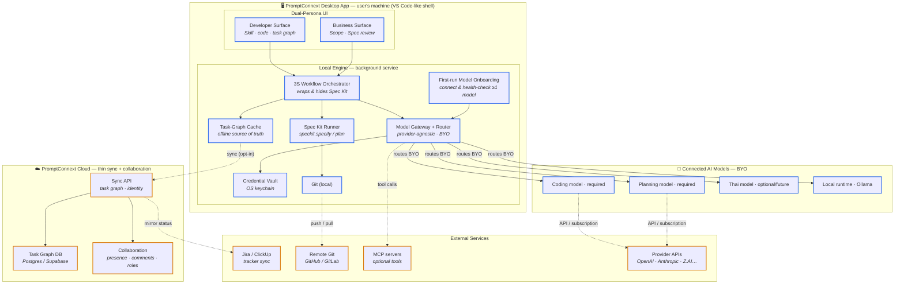
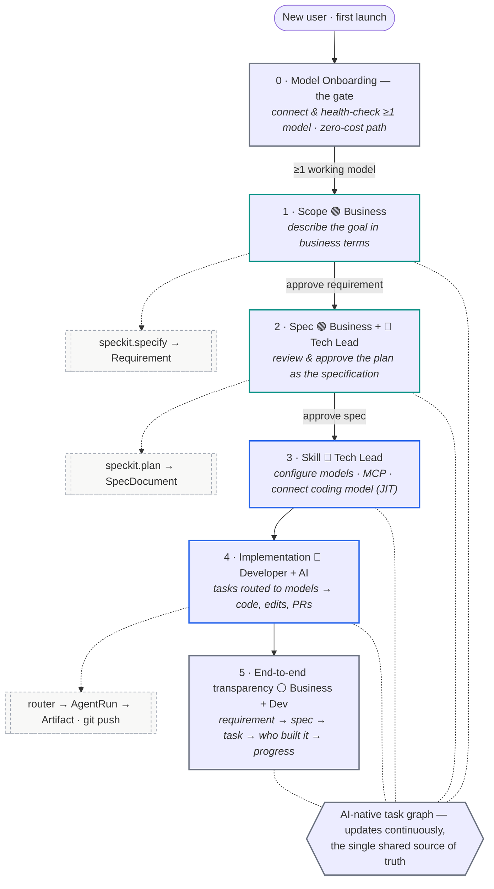

# PromptConnext — Diagrams

Editable Mermaid sources for the system architecture and the usage flow. Render in GitHub, VS Code, or any Mermaid viewer. Companion to [`promptconnext-platform-architecture.md`](./promptconnext-platform-architecture.md).

- **Blue = local** (runs on the user's machine: compute, keys, code).
- **Amber = remote** (cloud / external services).
- Only the **task graph** crosses to the cloud, and only when the user opts in.

---

## 1. System Architecture (all apps & components)

---

## 2. Usage Flow (first launch → shipped code)

3S is what the user sees; Spec Kit runs underneath (dashed nodes).

### Legend
- 🟢 Business · 🔵 Technical · ⚪ Any/shared
- **Gates** (labels on arrows) block progress until satisfied: a working model, an approved requirement, an approved spec.
- **Dashed engine nodes** are the hidden Spec Kit mechanics the user never sees.
