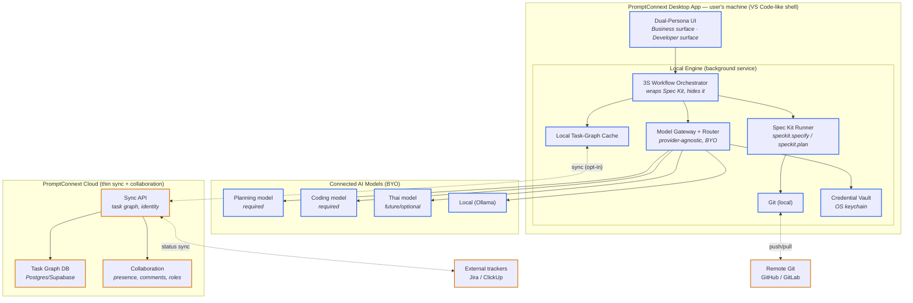

# PromptConnext — Platform Architecture

**Date:** 2026-06-29
**Status:** Draft v1 for review. Produced with the system-design framework (requirements → high-level design → deep dive → scale/reliability → trade-offs).
**Companion:** [`promptconnext-product-roadmap.md`](./promptconnext-product-roadmap.md) (vision, 3S, phasing). Background memos in the `ideva-kit` repo `docs/`.

---

## 0. Key assumptions (stated explicitly)

1. **Deployment shape = hybrid desktop client + cloud sync** (the pivotal decision; see §2.1). A local engine keeps compute, model keys, and code on the user's machine; a thin cloud service holds the shared task graph, identity, and collaboration. This is the only shape consistent with "VS Code-like," "bring your own model," "local models," and "computation stays local when possible." *If the product is instead a pure web app, §2–§4 change materially — flag before building.*
2. **Spec Kit (GitHub) is the workflow engine**, wrapped and hidden behind the 3S experience. PromptConnext owns the UX and the task graph; Spec Kit owns spec/plan generation mechanics.
3. **Models are BYO** — no proprietary model. The platform ships a provider-agnostic gateway, not weights.
4. **Reuse the Ideva Kit stack where sensible** (FastAPI / Python, Next.js / TypeScript, Supabase/Postgres) to move fast, unless the desktop shell dictates otherwise.
5. **Ideva Kit stays as-is**; PromptConnext is a clean, separate codebase that borrows proven data shapes (e.g. acceptance criteria as `{text}[]`).

---

## 1. Requirements

### 1.1 Functional
- Guide any user through **Scope → Spec → Skill** without exposing Spec Kit internals.
- **Scope** runs `speckit.specify`; **Spec** runs `speckit.plan` and presents the result as the project specification; **Skill** lets a Tech Lead configure models, AI skills, MCP servers, and implementation settings.
- Let users **connect their own AI models** (≥1 planning model, ≥1 coding model) via two connection modes.
- **First-run onboarding gate (BYOM cold-start):** assume a new user has **zero** models configured. Before any 3S work, guide them to connect and verify **at least one working model**, so no one reaches the product with a dead configuration.
- Maintain an **AI-native task graph**: requirement → spec → task → artefact → agent-run → progress, fully traceable both directions.
- **Route each task** to the connected model best suited to it (provider-agnostic).
- **Mandatory integrations:** Git and task tracking (native graph; optional two-way sync to Jira/ClickUp). **Optional:** MCP servers / webhooks.
- Serve **two personas** in one workspace: business (scope/plan/spec) and technical (implementation/coding).

### 1.2 Non-functional
| Concern | Target / stance |
|---|---|
| **Privacy** | Code, model keys, and inference stay on the user's machine by default; cloud sees the task graph + metadata the user opts to share. |
| **Latency** | 3S step feedback streamed; model latency is the connected provider's, not ours. |
| **Availability** | Cloud sync 99.9%; the desktop engine must keep working **offline** for local-model workflows (degrade collaboration, not core work). |
| **Cost** | No per-token cost to PromptConnext — users pay their own providers. Our cost is sync infra + storage. |
| **Portability** | Any OpenAI-compatible provider or local runtime pluggable without code changes. |
| **Security** | Model credentials stored in the OS keychain locally, never in the cloud in plaintext. |

### 1.3 Constraints
- Small team → **build the novel core deep, borrow commodity** (Spec Kit engine, provider SDKs, Git, external trackers).
- Mixed market (enterprise + greenfield) → one architecture, config-driven, not two products.
- Must not become "a general editor" — scope discipline (roadmap §8, risk 3).

---

## 2. High-Level Design

### 2.1 The pivotal decision — where does execution run?

| Option | Compute/keys/models location | Pros | Cons | Verdict |
|---|---|---|---|---|
| **A. Pure web app** | Cloud | Easiest to build & collaborate | Can't reach local Ollama or local Git; sends code+keys to cloud → breaks the privacy/BYO story | ✗ |
| **B. Pure desktop** | Local only | Max privacy | No collaboration/transparency spine — kills the core value | ✗ |
| **C. Hybrid: desktop engine + cloud sync** | Compute/keys local; **graph** in cloud | Privacy *and* collaboration; offline-capable; BYO-native | More moving parts (two runtimes to ship) | ✓ **Recommended** |

### 2.2 Component diagram



*Blue = runs locally (compute/keys/code). Amber = remote. The only thing that crosses to the cloud by default is the task graph the user chooses to share.*

### 2.3 Component responsibilities

| Component | Responsibility |
|---|---|
| **Dual-Persona UI** | VS Code-like shell. Business surface = guided 3S; Developer surface = models/MCP/graph/code. Same project, two altitudes. |
| **3S Workflow Orchestrator** | The product brain. Maps Scope→`specify`, Spec→`plan`, Skill→config+implementation. Enforces gates (can't advance without approval). Writes every step into the task graph. |
| **Spec Kit Runner** | Executes Spec Kit commands in the local workspace; never surfaced to users. |
| **Model Gateway + Router** | Normalizes all providers to one interface; routes tasks to the right connected model by role; holds the two connection modes; degrades gracefully to the two required models. |
| **Credential Vault** | Model keys/tokens in OS keychain. Never leaves the machine. |
| **Local Task-Graph Cache** | A cache of the cloud's graph (ADR 0020); readable offline, rebuilt from the cloud without loss. |
| **PromptConnext Cloud** | Identity, the shared task graph, collaboration (presence/comments/roles), external-tracker sync, and a workspace-BYO RAG assistant (ADR 0011, plan 0005 M9). No source code at rest; no *end-user* credentials — only a workspace admin's own model key, encrypted server-side. |

---

## 3. Deep Dive

### 3.1 Data model — the AI-native task graph (the moat)

```
Project
 ├─ Requirement        (from Scope)         id, title, description, status
 │   └─ SpecDocument   (from Spec/plan)      id, requirement_id, content, version, approved_by
 │        └─ Task                            id, spec_id, title, status, feature_tag
 │             ├─ AcceptanceCriterion[]      {text}   ← reuse Ideva Kit shape
 │             ├─ Artifact[]                 id, task_id, kind(code|pr|doc), uri, commit_sha
 │             └─ AgentRun[]                 id, task_id, model_connection_id, action,
 │                                            input_ref, output_ref, status, evidence
 ├─ ModelConnection[]  role(plan|code|thai|other), mode(api_key|subscription),
 │                     provider, endpoint, credential_ref
 ├─ Integration[]      kind(git|jira|clickup|mcp), config, required(bool)
 ├─ StageState         scope|spec|skill → {status, gate_passed, approver}
 └─ ModelOnboardingState  not_started|in_progress|satisfied  ← gates workspace entry
```

Design rules: **PromptConnext is authoritative** for AI-native fields (AgentRun, Artifact, spec traceability, acceptance criteria). External trackers are authoritative only for the fields they own (assignee, sprint) — this per-field ownership avoids bidirectional-sync conflict logic (task-management memo).

### 3.2 API contracts (representative)

**Local Engine API** (client ↔ local engine, localhost only):
```
POST  /engine/projects/{id}/scope        → run specify, stream progress, create Requirement
POST  /engine/projects/{id}/spec         → run plan, produce SpecDocument (awaits approval)
POST  /engine/projects/{id}/skill/config → set ModelConnections, MCP servers, settings
POST  /engine/tasks/{id}/run             → route to model, execute, append AgentRun + Artifact
GET   /engine/models                     → list connected models + health per role
POST  /engine/models/connect             → add connection (mode: api_key | subscription)
GET   /engine/onboarding/state           → not_started | in_progress | satisfied
POST  /engine/onboarding/verify          → live health-check a connection before accepting it
GET   /engine/onboarding/recommendations → suggested provider/model per role (+ zero-cost path)
```

**Cloud Sync API** (engine ↔ cloud):
```
PUT   /sync/projects/{id}/graph          → push local graph delta (opt-in)
GET   /sync/projects/{id}/graph          → pull collaborators' changes
POST  /sync/integrations/jira/mirror     → project a task to external tracker
WS    /sync/projects/{id}/presence       → live collaboration
```

Two things flow in opposite directions, and ADR 0015 keeps them strictly
separate. The **task graph** is **cloud-authoritative** since ADR 0020 (the cloud
authors it and the local graph is a cache; per-field ownership survives only for
the few tracker-owned fields). But the **workspace/project roster** — which
workspaces a signed-in user belongs to and which projects live in them — is
**cloud-authoritative**: the engine mirrors the existing member-scoped
`GET /workspaces` + `GET /projects` into a local roster cache so the desktop
renders fully offline, refreshing it on sign-in / focus / explicit refresh and
scrubbing it on sign-out. Opening a roster project this machine has never seen
triggers a one-shot **full-graph bootstrap-pull** (`GET /sync/projects/{id}/graph`
with no `since`, keyset-paginated) that replicates the cloud's already-merged
state into empty local tables — after which the local graph is a cache as
usual. Consequently, offline-first now holds **after a first successful sign-in
on that machine**, not on a cold, never-signed-in install (ADR 0015 narrows
ADR 0003's "works with no network" for the roster, not the graph).

### 3.3 Model Gateway — the two connection modes
- **Mode 1 — API key / endpoint:** user supplies key or OpenAI-compatible base URL (OpenAI, Anthropic, Google, Z.AI/GLM, OpenRouter, Ollama, vLLM). Universal; metered by provider.
- **Mode 2 — Subscription / agentic auth:** sign in with a plan where the provider permits programmatic use (e.g. Claude Code on Pro/Max with its dedicated programmatic budget). Per-provider ToS review required before enabling.
- **Router:** classifies each task (plan vs. code vs. Thai vs. hard) and dispatches to the connected model for that role; falls back within role; can escalate to a stronger connected model. Provider-agnostic — selects only among what the team connected.

### 3.4 First-run model onboarding (BYOM cold-start)

**Assumption:** a new user arrives with **no models configured**. Onboarding is a hard precondition — a blocking gate ahead of Scope — because every downstream stage needs at least one working model.

Flow:
1. **Detect empty config.** On first launch (or when `ModelConnection[]` is empty), route the user into onboarding instead of the workspace.
2. **Guide connection.** Offer a provider picker with the two connection modes (§3.3) and a clear "no cost / nothing to sign up for" path for users who have nothing yet — **local Ollama** (download a small model) or a free-tier/OpenRouter key. This guarantees even a user with zero prior AI spend can complete setup.
3. **Verify with a live health check.** Never accept a key on faith — the local engine fires a tiny test call and confirms a real response before marking the connection valid. A pasted-but-broken key is the most common failure; catch it here, not mid-Spec.
4. **Assign a role.** The first working model is tagged (typically `plan`, since Scope comes first). The user can start with **one** model to cross the gate.
5. **Progressive second-model prompt.** The full 3S flow needs a `code` model too, but we don't block entry on it. Onboarding satisfies the *minimum-one* rule to start; when the user first reaches **Skill/implementation**, prompt to connect the coding model then (just-in-time, when its value is obvious). This lowers first-run friction while still reaching the connect-two end state.
6. **Recommended profiles.** Surface a suggested model per role (capability guardrail, roadmap open-decision #5) so users don't connect something too weak and blame the product.

State: a `ModelOnboardingState` (`not_started → in_progress → satisfied`) gates workspace entry. `satisfied` requires ≥1 health-checked connection.

Under ADR 0015 (feature-flagged for staged rollout, `VITE_MEMBERSHIP_GATE`), model onboarding is no longer the outermost gate: two access gates sit *ahead* of it, so the desktop's launch order is **engine health → identity (signed in?) → membership (≥1 workspace?) → model onboarding → Workspace/3S**. Identity is the outer gate — model onboarding answers "can this user *do* 3S work"; the new gates answer "is this user *allowed in*, and *whose* workspace." A cached, refresh-extended session counts as signed in (offline-first holds after a first sign-in on the machine), so the gates are evaluated at cold-start/focus, never as a live network check on launch. When the flag is off, or under stub/dev auth (`AUTH_MODE=stub`) or a cloud-disabled build, the gates relax and the launch order is unchanged from the pre-0015 behavior.

Because the roster is now the authority for what's reachable, a project that was never linked to a workspace (`cloud_workspace_id = null`, born before the gate) no longer appears as a project tab under the gate. Rather than silently migrate such a project into a workspace, the desktop surfaces a **one-time import affordance** on the workspace screen: each pre-existing local-only project can be linked to a workspace the user picks (reusing today's `linkProjectToCloud` + push sync), after which it joins the roster. Declining is non-destructive — the project stays local and private on that machine, simply unreachable under the gate until the user chooses to import it later. To match a local project to its roster tab exactly (and never hide a distinct pending project behind a duplicate name), the engine now surfaces the project's `cloud_project_id` alongside `cloud_workspace_id`, so roster deduplication keys on the cloud id and falls back to name only for a project that has never been linked.

### 3.5 Error handling
- Model call fails → retry with backoff, then surface a clear "provider X errored" with a switch-model option (never a silent stall).
- Spec Kit step fails → mark StageState failed with the underlying error; offer retry (mirrors Ideva Kit's orphan-detection pattern).
- Offline → local engine keeps working against local models + local Git; sync queues deltas and reconciles on reconnect.

---

## 4. Scale & Reliability

- **Load reality:** heavy compute (inference, Spec Kit, Git) is **distributed to each user's machine** → the cloud scales with *graph size and collaboration events*, not tokens. This is inherently cheap and horizontally simple.
- **Cloud scaling:** stateless Sync API behind a load balancer; Postgres/Supabase with read replicas as graph volume grows; WebSocket presence on a pub/sub layer.
- **Reliability:** a cloud outage must not block local work — cached tasks stay readable and status changes queue until reconnect (ADR 0020 reduced ADR 0003's guarantee deliberately); the remaining multi-writer boundary is the tracker mirror, where per-field ownership still resolves conflicts.
- **Monitoring:** engine emits local health (model reachability, step timing); cloud tracks sync lag, conflict rate, external-sync failures.

---

## 5. Trade-off Analysis & What to Revisit

| Decision | Trade-off accepted | Revisit when |
|---|---|---|
| **Hybrid desktop+cloud** | Two runtimes to build/ship vs. privacy + offline + BYO | If web-only demand dominates and privacy proves non-critical |
| **Spec Kit as hidden engine** | Coupled to Spec Kit's evolution vs. huge head start | If Spec Kit limits the 3S UX we want |
| **BYO-only model layer** | No control over model quality vs. no model tax, no lock-in | If a bundled default model materially lifts activation |
| **Native task graph + thin sync** | We maintain a data model vs. owning the moat | Never for the core; expand sync connectors on demand |
| **Reuse Ideva Kit stack** | Familiarity/speed vs. desktop shell may prefer Tauri/Electron+local service | At desktop-shell spike |
| **Per-field sync ownership** | Some fields one-way vs. avoiding conflict hell | If customers demand full bidirectional parity |

**Open technical decisions to confirm (in priority order):**
1. **Desktop shell** (Tauri vs. Electron) and whether developers code *in* PromptConnext or in their own IDE with PromptConnext orchestrating — biggest scope lever.
2. **Local engine language/runtime** — reuse FastAPI as a bundled local service, or a native sidecar.
3. **Which providers** to support per connection mode at launch; ToS review for Mode 2.
4. **Sync granularity & conflict policy** beyond per-field ownership.
5. **Minimum recommended model profile** per role (activation quality guardrail).

---

## 6. Bottom line

The architecture puts the **novel, defensible parts local and native** — the 3S orchestrator, the model gateway/router, and the AI-native task graph — while keeping the **commodity parts borrowed and thin**: Spec Kit as the engine, providers as BYO plugins, external trackers as sync targets, the cloud as a lightweight collaboration spine. Heavy compute lives on the user's machine, which makes privacy real, cost near-zero for us, and offline work possible — with the shared task graph as the one thing that syncs, delivering the end-to-end transparency that is the product's reason to exist.
